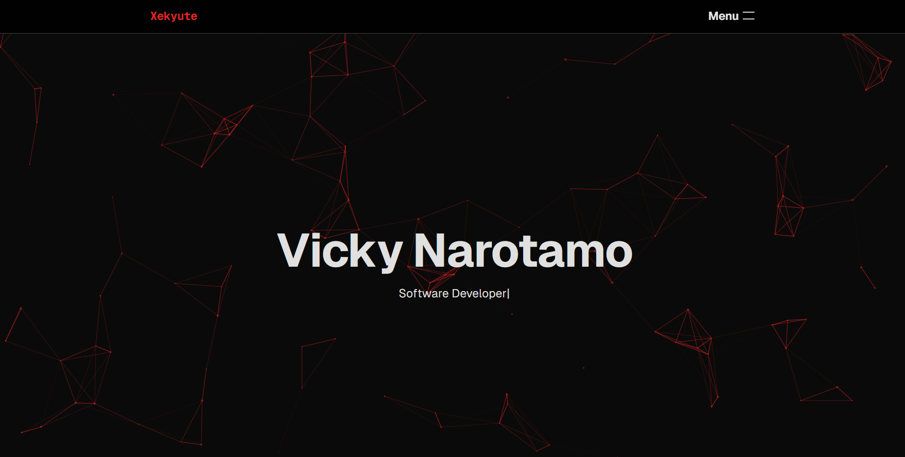

# Xekyute Portfolio

A modern, full-stack developer portfolio built to showcase clean UI, scalable structure, and real backend functionality.

**Live Demo:** https://xekyute-portfolio.vercel.app  
**GitHub Repo:** https://github.com/Xekyute/Web-Portfolio

---

## Overview

This portfolio is more than a static website.  
It includes real backend logic, secure data handling, and production deployment practices.

Key features include:

- Responsive, animated UI
- Fully functional contact form
- Database-backed message storage
- Email notifications on form submission
- Secure environment variable handling
- Production deployment with Vercel

Designed to grow as more projects and features are added.

---

## Tech Stack

**Frontend**

- Next.js (App Router)
- React
- Tailwind CSS
- TypeScript

**Backend**

- Next.js API Routes
- Supabase (PostgreSQL)
- Row Level Security (RLS)

**Infrastructure**

- Vercel (Deployment)
- Resend (Email delivery)
- Environment based config

---

## Contact Form Flow

1. User submits the form
2. Request handled via server side API route
3. Message stored securely in Supabase
4. Email notification sent via Resend
5. Designed with extensibility for:
   - Rate limiting
   - IP logging
   - Admin dashboards

---

## Future Improvements

- Rate limiting & abuse protection
- Admin dashboard for messages
- Featured project sections
- Authentication-protected routes
- Performance & accessibility refinements

---

## Author

**Vicky Narotamo**  
Computer Science student & aspiring software engineer
